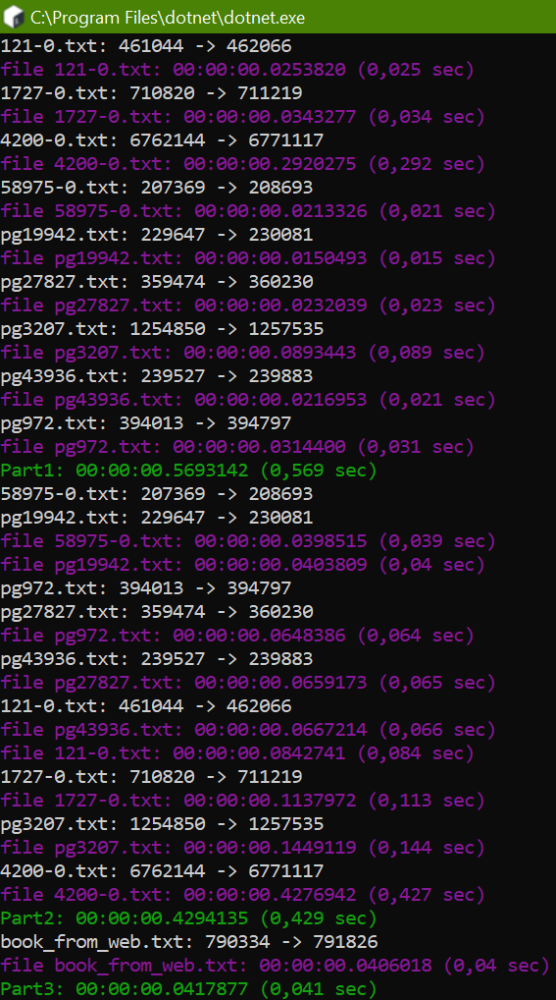

# Домашка №3 По Проге (для HSE)
##### (хотя она вроде типа самостоятельная)

вот ссылка на [условие](https://docs.google.com/document/d/1iQDiyBXgWBV71IYMM-40Tf7FF2EUA9ObnnPOh6fwWoc/edit) если комуто надо

тут у меня было некоторое количество проблем с многопоточностью
1. если вылизает эксепшен про `non-concurrent collections`, то надо заменить `Dictionary` на `ConcurrentDictionary`
2. если цвет консоли меняется неправильно надо `lock (Console.Out) {}`
3. ещё когда я делал табличку для маленьких букв, у меня был эксепшен про то что мельзя менять то что у тебя в `foreach` (это хороший эксепшен)
4. тут я ещё сделал магию из курсача, где у меня весь код автоматически форматируется

# Я тут всётаки решил написать это на си, чтобы посмотреть насколько будет быстрее

я вообще думал что будет раз в 10 быстрее, но он только в 1.5 раза >:[

тут ещё можно заметить что тут везде на один символ больше чем надо

это происходит потому что во всех этих книгах первый символ это bom и с# его не считает

